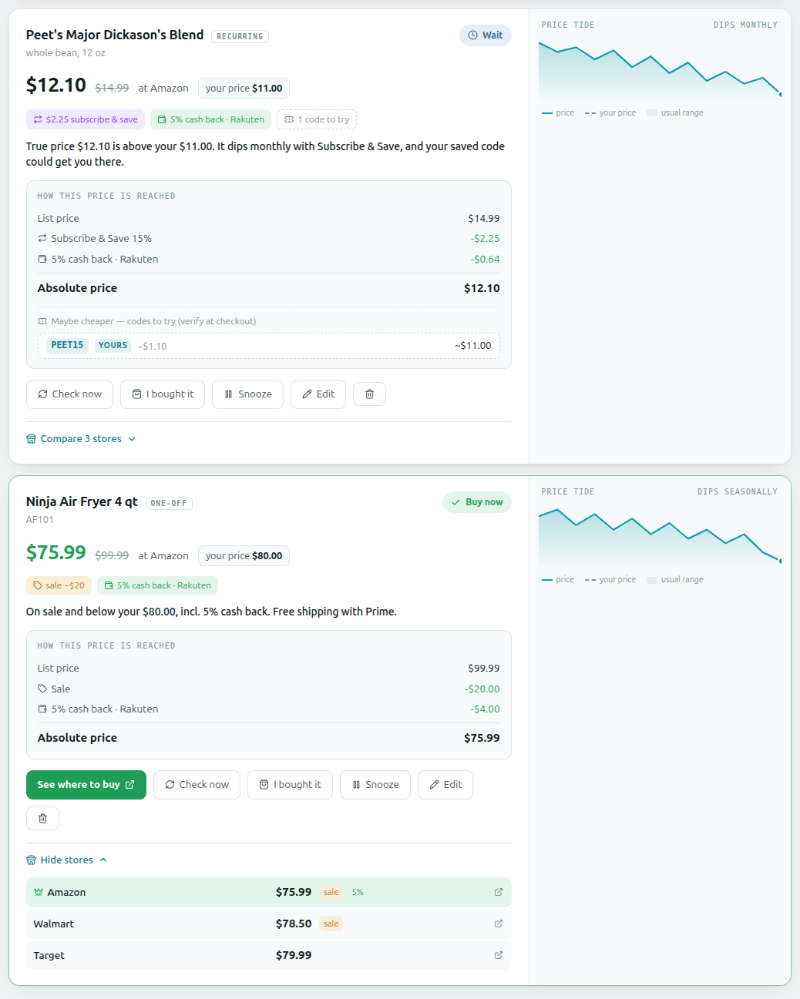
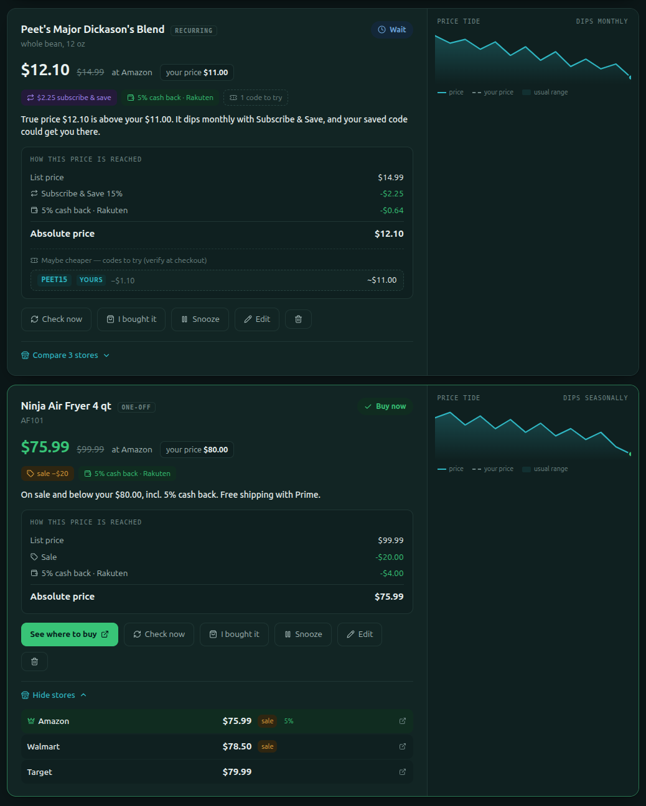
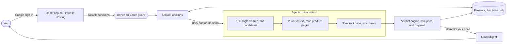

# 🌊 ZeroTide

**Set your price. Walk away. Get pinged at the trough.**


ZeroTide is an **agentic-AI** shopping price tracker. You add *intentions* ("I'd buy this at $X") and it watches the web for you: an AI agent searches, **opens and reads the actual product pages** to verify the exact size and current price, works out the *true* delivered price (subscription discounts, cashback, shipping), and only tells you to buy when your terms are met. Promo codes are surfaced as clickable "maybe" prices you can try.

It runs **privately, for you**: a single-owner app locked to your Google account, and is built to be **as close to free as possible**: you bring your own API keys and pay only for what you use.

**▶ Live demo:** **[zerotide.web.app](https://zerotide.web.app)**  ·  **Source:** [github.com/MohsenZand/zerotide](https://github.com/MohsenZand/zerotide)

Sign-in is **owner-only by design**: it keeps the app private and controls AI cost, so the public URL shows the sign-in screen. To try it yourself, deploy your own instance (see [Setup](#setup)).

> **Heads-up on cost:** the AI looks up *live* prices using Google Search grounding, which is billed per request by Google (it is not free). ZeroTide minimizes this (a cheap model, a hard daily call cap, few page reads), but "free" here means "pennies at personal scale," not zero. See [Cost & billing](#cost--billing).

---

## Screenshots

Each item shows its true delivered price, a step-by-step breakdown (list price, subscription, cash back, shipping), "maybe" codes to try, a price-tide chart, and a per-store comparison.



<details>
<summary><b>Dark mode</b> (ZeroTide is fully themed)</summary>



</details>

---

## Features

- **Agentic price lookup**: searches the whole web, then reads real product pages to verify exact size + current price (not just search snippets).
- **True / "absolute" price**: list price − subscription/auto-delivery discount − your cashback + shipping, shown as a transparent, step-by-step breakdown with real links.
- **"Maybe" prices**: every working promo code it finds, each as a clickable *code → ~$price* suggestion to verify at checkout.
- **Per-store comparison**: see every store's price, deals, and links; the manufacturer's official site is flagged.
- **Exact-size matching**: wrong-size listings are excluded from the best price and flagged.
- **Price-tide chart**: each item's price over time, with your target and its usual range.
- **Buy-now email digest**: a free Gmail notification when something hits your price (optional).
- **Recurring items**: set a rebuy interval; buying pauses the item until the next cycle.
- **Owner-only**: Google sign-in locked to your email(s); everyone else is rejected.
- **Configurable**: ZIP, preferred stores, cashback programs you're enrolled in, daily AI-call cap.

## How it works

- **Frontend:** React + Vite + Tailwind, deployed to Firebase Hosting.
- **Backend:** Firebase Cloud Functions (Node 20, Gen 2). Firestore is fully locked to direct client access; everything goes through callable functions using the Admin SDK.
- **AI:** Google Gemini (`gemini-flash-lite-latest`) with the `googleSearch` + `urlContext` tools, so the model both searches **and reads pages**. The verdict/true-price math is deterministic code, not the LLM.
- **Auth:** Firebase Authentication (Google), gated server-side to an owner allowlist.
- **Email:** Gmail SMTP via nodemailer (optional).



> **Accuracy disclaimer:** prices are AI estimates read from live web pages and shown "as of" a date. They can be wrong (blocked pages, cached prices, discounts that don't combine). **Always confirm at the store before buying.** ZeroTide errs toward conservative, verifiable prices.

## Engineering highlights

Things in here worth a closer look:

- **Agentic tool-use, not a single prompt.** The lookup gives Gemini both `googleSearch` and `urlContext`, so it *searches then opens and reads the real product pages* to verify the exact size and current price; this fixed a whole class of "wrong-size / wrong-price" errors that snippet-only lookups make.
- **LLM proposes, code decides.** The AI only returns structured facts (prices, discounts, shipping, links). A deterministic **verdict engine** computes the true price and the buy/wait decision, so pricing is predictable, testable, and not at the mercy of the model.
- **Trust-first price modelling.** The headline "absolute" price uses only page-verifiable discounts (sale price, subscription, your enrolled cashback, shipping). Unverifiable promo codes are never silently applied; they're surfaced as opt-in "maybe" prices. Coupon + subscription are never stacked when they can't combine.
- **Security without user accounts.** Firestore denies all direct client access; every read/write is a callable function using the Admin SDK, gated to an owner-email allowlist. A public URL that's safe to leave up.
- **Cost engineering.** Live web grounding is billed per request, so the design leans on a cheap model, ≤2 page reads per lookup, a hard daily call cap, per-item cooldowns, and one scheduled daily batch, keeping real-world spend at pennies.
- **Defensive data pipeline.** JSON-from-LLM is fence-stripped and schema-validated; links are host-checked against the store and re-verified with a real fetch (dead 404s fall back to a search); undefined values can't crash a Firestore write.

---

## Prerequisites

- **Node.js 20+** and npm
- A **Google account**
- The **Firebase CLI**: `npm install -g firebase-tools`
- A **Firebase project on the Blaze (pay-as-you-go) plan**: Cloud Functions require it. (Blaze has a generous free tier; ZeroTide's usage is tiny.)
- A **Gemini API key** with billing enabled (Google Search grounding is a paid feature; see [Cost & billing](#cost--billing)).
- *(Optional)* A **Gmail account with an App Password** for email notifications.

## Setup

### 1. Clone & install

```bash
git clone <repo-url> zerotide
cd zerotide
npm install
cd functions && npm install && cd ..
```

### 2. Create a Firebase project

1. Create a project at the [Firebase Console](https://console.firebase.google.com/) and upgrade it to the **Blaze** plan.
2. **Authentication → Sign-in method →** enable **Google**.
3. **Firestore Database →** create a database (production mode is fine; the rules lock it down).
4. Add a **Web app** (Project settings → Your apps → Web) and copy its config.
5. Put your project id in `.firebaserc`:
   ```json
   { "projects": { "default": "your-firebase-project-id" } }
   ```

### 3. Frontend config

```bash
cp .env.example .env
```
Fill `.env` with the Web app config from step 2.4.

### 4. Owner allowlist (who can use your app)

```bash
cp functions/.env.example functions/.env
```
Set your Google account email(s); only these can read or change anything:
```
ZEROTIDE_OWNER_EMAILS=you@gmail.com
```

### 5. Gemini API key

Create a key at [Google AI Studio](https://aistudio.google.com/apikey) **in your Firebase project**, and make sure that project has **billing enabled** (Search grounding requires the paid tier). Then store it as a secret:
```bash
firebase functions:secrets:set GEMINI_API_KEY
```

### 6. (Optional) Gmail email notifications

Requires 2-Step Verification on the Google account, then an [App Password](https://myaccount.google.com/apppasswords):
```bash
firebase functions:secrets:set GMAIL_USER            # the Gmail address to send from
firebase functions:secrets:set GMAIL_APP_PASSWORD    # the 16-char app password
```
If you skip this, everything works except the Buy-now email digest.

### 7. Deploy

```bash
firebase login
npm run build
firebase deploy --only firestore:rules,functions,hosting
```
Your app is live at `https://<your-project-id>.web.app`. Sign in with an owner email and start adding items.

### 8. Run locally (dev)

```bash
npm run dev            # frontend on http://localhost:5176 (talks to deployed functions)
```
To use the local emulators instead, set `VITE_USE_EMULATORS=true` in `.env` and run:
```bash
cd functions && npm run serve   # functions + firestore emulators
```
Real Gemini/Gmail calls still go out over the network under the emulator; that's expected.

---

## Cost & billing

The **only meaningful cost is Gemini's Google Search grounding**, billed per request. Everything else (Cloud Functions, Firestore, Hosting, Gmail) sits comfortably in free tiers at personal scale.

ZeroTide minimizes AI spend by:
- using the low-cost **`gemini-flash-lite-latest`** model,
- reading **at most ~2 pages** per lookup,
- checking a small set of priority stores,
- a hard **daily AI-call cap** (`maxDailyAiCalls`, default 20, editable in Settings),
- a per-item cooldown on manual "Check now",
- and a once-daily scheduled refresh.

Each price check = one grounded request. **Watch your actual usage** in the Google Cloud billing console, verify current grounding pricing at [ai.google.dev/pricing](https://ai.google.dev/pricing), and set a **billing budget alert**. Lower the daily cap and track fewer items to spend less.

## Security model

- Firestore rules **deny all direct client access**; every read/write is a callable function using the Admin SDK.
- Every callable requires a signed-in Google user whose verified email is in `ZEROTIDE_OWNER_EMAILS`; everyone else is rejected. This is what makes the public URL safe.
- Secrets (API keys, Gmail password) live in Google Secret Manager, never in the repo.
- `.env`, `functions/.env`, and all keys are gitignored.

## Configuration (in-app Settings)

- **ZIP code**: for local pricing/shipping.
- **Preferred stores**: priorities (search still spans the web).
- **Your cashback programs**: only cashback you can actually redeem counts toward the true price.
- **Daily AI-call cap** and **manual-check cooldown**: cost controls.
- **Notification email** + toggle: Buy-now digest.

## Project structure

```
├── src/                     # React frontend
│   ├── components/          # layout, common, items, settings, auth
│   ├── contexts/            # ShoppingContext (state + service orchestration)
│   ├── pages/               # Dashboard, Settings
│   └── services/            # callable-function wrappers
├── functions/               # Cloud Functions (Gen 2, CommonJS)
│   ├── geminiPriceClient.js # agentic Gemini lookup (search + read pages)
│   ├── verdict.js           # deterministic true-price + verdict engine
│   ├── priceRefresh.js      # scheduled batch + on-demand "check now"
│   ├── intentions.js        # watch-list CRUD, snooze
│   ├── settings.js          # settings CRUD
│   ├── notify.js            # Gmail digest
│   └── auth.js              # owner-only guard
├── firestore.rules          # deny-all (functions-only access)
└── scripts/                 # maintenance scripts
```

## License

**All rights reserved.** This repository is published publicly for portfolio and
evaluation purposes only. The source is available to read, but it is **not** licensed
for reuse; you may not use, copy, modify, or redistribute it without written
permission. See [LICENSE](LICENSE). To run your own copy, contact the author.

---

*Disclaimer: ZeroTide shows AI-generated price estimates for your convenience. It is not affiliated with any retailer, and prices/coupons may be inaccurate or out of date. Always verify at the store before purchasing.*
